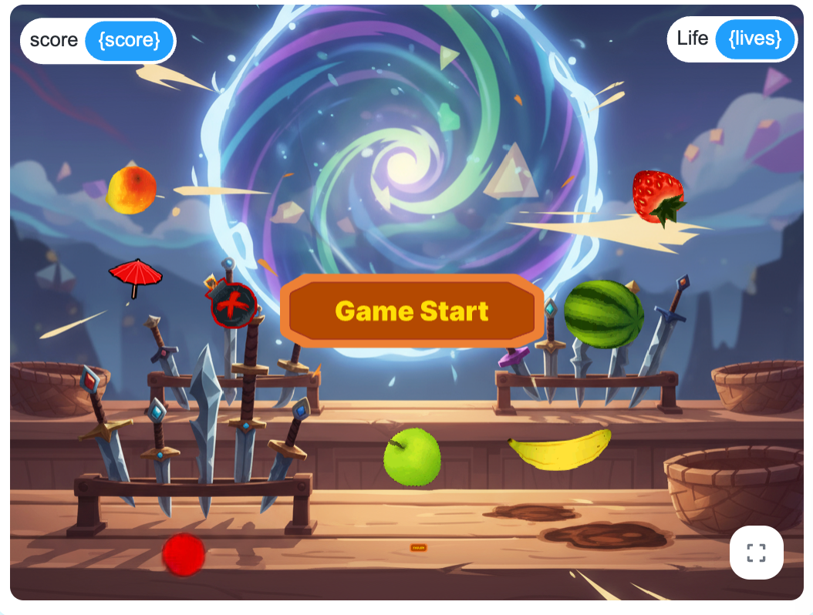

# 数字码农


这是一个基于`XBuilder`的切水果游戏，玩家通过鼠标滑动切割水果获得分数，同时需要避开炸弹。

## 游戏Demo演示视频

<video src="http://qupfile.cloudvdn.com/Demo%E6%BC%94%E7%A4%BA.mp4" controls width="100%"></video>
在线地址：http://qupfile.cloudvdn.com/Demo%E6%BC%94%E7%A4%BA.mp4
对应github中视频文件：[Demo演示.mp4](./Demo演示.mp4)

## XBuilder项目发布
https://x.qiniu.com/project/wx_user_AFMTXo8Q/19

## 游戏截图




## 游戏规则

- 屏幕上会不断出现各种水果（西瓜、苹果、桃子、Basaha、香蕉）和炸弹
- 按住鼠标左键并划过屏幕，会出现金色刀光轨迹
- 划到水果可以获得分数
  - 切到1个水果得1分
  - 连续切到多个水果有连击加分（连击数+1）
- 如果划到炸弹，会失去一条生命并中断连击
- 切到特殊的伞形道具可以增加生命值，上线不超过3条
- 当生命值降为0时，游戏结束

## 如何运行

1. 打开`XBuilder`开发环境
2. 加载`MyFirstProject_v1.9.xbp`项目文件
3. 点击运行按钮启动游戏
4. 点击"开始"按钮开始游戏

## 游戏控制

- **鼠标左键按下并滑动**：切割水果
- **点击开始按钮**：开始游戏

## 游戏特性和负责人

- **多种水果类型**：西瓜、苹果、桃子、Basaha、香蕉，每种水果都有独特的切割动画 by hugo
- **物理模拟**：水果会受重力影响自然下落，具有真实的抛物线运动轨迹 by Micheal
- **刀光轨迹**：鼠标移动时会显示红色刀光轨迹，增强切割体验 by hugo
- **切割动画**：水果被切后会分成两部分，并向两侧飞散 by hugo
- **炸弹机制**：切到炸弹会触发爆炸效果并扣除一条生命 by Yb
- **生命系统**：初始3条生命，可通过收集伞形道具增加（最多3条）by Yb
- **得分系统**：根据连击数计算得分，连续切割水果可获得额外加分 by Micheal
- **连击系统**：1秒内连续切割水果可累积连击数，获得更高分数 by Micheal
- **音效**：不同场景不同音效 by Yb

## 技术实现

- **开发平台**：基于`XBuilder`引擎开发
- **物理引擎**：实现了物理模拟（重力效果、抛物线运动）
- **刀光轨迹**：通过克隆技术实现流畅的刀光轨迹效果
- **切割检测**：基于距离检测实现精确的切割判定
- **消息系统**：使用广播机制实现精灵间的通信
- **动画系统**：实现了水果切割、炸弹爆炸等多种动画效果
- **UI系统**：实现了生命值显示、得分系统等UI元素

## 代码结构

```
code/
├── main.spx        # 主程序，控制游戏流程和全局变量
├── Start.spx       # 开始界面精灵
├── Apple.spx       # 苹果精灵
├── Watermelon.spx  # 西瓜精灵
├── Peach.spx       # 桃子精灵
├── Basaha.spx      # Basaha精灵
├── Banana.spx      # 香蕉精灵
├── Bomb.spx        # 炸弹精灵
├── Life.spx        # 生命值道具精灵
└── Blade.spx       # 刀光轨迹精灵
```

### 主要组件说明

- **main.spx**：游戏主控制器，负责初始化游戏状态、管理得分和生命值、处理游戏流程
- **水果精灵**（Apple.spx, Watermelon.spx等）：实现水果的生成、运动、切割检测和切割动画
- **Bomb.spx**：实现炸弹的生成、运动、爆炸检测和爆炸特效
- **Life.spx**：实现生命值道具的生成、收集和生命值显示图标的管理
- **Blade.spx**：实现刀光轨迹的生成和显示效果
- **Start.spx**：实现游戏开始界面和开始按钮

## 扩展可能

- **添加更多水果类型**：如橙子、葡萄、草莓等
- **添加音效和背景音乐**：切割音效、爆炸音效、背景音乐等
- **添加更丰富的视觉效果**：粒子效果、背景变化、季节主题等
- **添加关卡系统**：不同难度关卡，目标分数挑战
- **添加特殊道具**：时间减缓、双倍得分、护盾等
- **添加在线排行榜**：本地高分记录或在线排行榜
- **添加游戏模式**：限时模式、无尽模式、挑战模式等
- **优化性能**：对象池管理、减少内存占用等
- **添加教程系统**：新手引导、操作提示等

